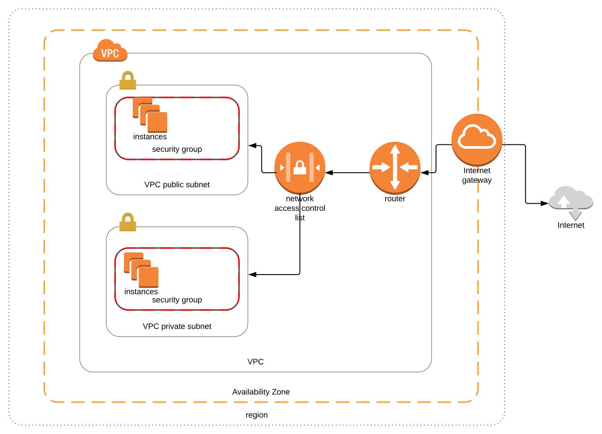

# AWS

- [AWS](#aws)
  - [Overview](#overview)
  - [Regions](#regions)
  - [IAM](#iam)
    - [User Creation](#user-creation)
    - [Notifications](#notifications)
  - [S3](#s3)
    - [Write Consistency](#write-consistency)
    - [S3 Object Storage Attributes](#s3-object-storage-attributes)
    - [Storage Tiers](#storage-tiers)
    - [Encryption](#encryption)
    - [Control](#control)
    - [Versioning](#versioning)
    - [Cross Region Replication](#cross-region-replication)
    - [LifeCycle Management](#lifecycle-management)
    - [Transfer Acceleration](#transfer-acceleration)
    - [Static website](#static-website)
  - [CloudFront](#cloudfront)
  - [Storage Gateway](#storage-gateway)
  - [Snowball](#snowball)
  - [EC2](#ec2)
    - [SSH](#ssh)
    - [Pricing Options](#pricing-options)
    - [EC2 Types](#ec2-types)
    - [EBS Volumes](#ebs-volumes)
      - [Snapshots](#snapshots)
    - [Security Groups](#security-groups)
  - [VPC](#vpc)
    - [Resources](#resources)
    - [VPC-Overview](#vpc-overview)
      - [Options](#options)
    - [Important](#important)
    - [Anatomy of a VPC](#anatomy-of-a-vpc)
    - [Route Tables](#route-tables)
    - [Security groups](#security-groups)
    - [Creating a VPC](#creating-a-vpc)
    - [NAT Instance](#nat-instance)
    - [NAT Gateway](#nat-gateway)
    - [Network ACL](#network-acl)
    - [VPC Flow Logs](#vpc-flow-logs)
    - [NAT vs Bastion Servers](#nat-vs-bastion-servers)
    - [VPC Endpoints](#vpc-endpoints)

## Overview

## Regions

- 1 - N availability zones in a region
- Regions are literally a geographical region where data centers reside
- Edge locations are local caching regions
  - There are many more edge regions than actual regions

## IAM

| Term               | Definition                                                  |
| ------------------ | ----------------------------------------------------------- |
| Users              | A person or user                                            |
| Groups             | A collection of users                                       |
| Policies Documents | A json document that determines what users can or cannot do |
| Roles              | Roles are applied to aws resources                          |

### User Creation

- The user that created the original account basically behaves like a root user. The root user can create IAM users, groups and policies which is generally good practice.

- If you search IAM in the root of the aws console you will find where you can create all of these things. Note: Users are not region specific.

- Users have no permissions when they are created. You need to assign a policy.

- You only see the programmatic access key once.

### Notifications

- Can create billing notifications in `CloudWatch`

## S3

- `http://s3-{aws.region}.amazonaws.com/{bucket.name}`
- S3 Buckets are globally namespaced. Each bucket you create needs to be completely unique.
- S3 is considered object based storage. Files are referred to as objects.
- each file can be 0 - 5 TB
- Files are stored in buckets
- When a file is uploaded you get a 200 response.
- By default buckets are private as well as all objects inside them.

### Write Consistency

- `Puts` The initial write will complete before reads. This only applies to brand new object being uploaded.
- `Updates and Deletes` Eventual consistency. The reads will be dirty for some period of time.

### S3 Object Storage Attributes

- Key
- Value (the file)
- Version number
- MetaData (example: tags)
- SubResources
  - Control access on a specific file

### Storage Tiers

Pricing will change based on the tier.

- `Standard` High availability 99.99999999% and is located on multiple hard drives in multiple availability zones by default.
- `S3 - IA` (infrequent access) A little cheaper but can be accessed quickly
- `S3 Zone One IA` same thing but only stored in 1 availability zone.
- `Glacier` extremely slow access times (3 - 5 hours)
- `S3 Reduced Redundancy Storage` as the name implies

### Encryption

- In trasnit
  - Encryption with the TLS protocol during transmission.

- At Rest
  - `Client Side` the client can encrypt the file
  - `Server Side`
    - Amazon manages the encryption key
      - Amazon actually encrypts the key with a master key that is rotated (SSE-S3).
      - (SSE-KMS) uses an amazon key management service with additional security.
    - You can manage your own key (SSE-C, server side encryption customer)

### Control

- `ACL` access control list
  - Can control access all the way down to the object level
- `Bucket policies`
  - Control access at a bucket level.

### Versioning

- All versions are stored in the bucket
- Once you turn on versioning you cannot turn it off, only suspend it.
- Deleting just puts a delete marker over the last version and makes a copy. Deleting an object is S3 doesn't delete the object. It creates a new version that is called delete.
- Multi-factor authentication can be turned on for deleting a versioned object.

### Cross Region Replication

When files are uploaded to a bucket they are copied to another bucket automatically.

- Versioning must be turned on.
- The other bucket must actually be in another region.
- File are only copied to another bucket on a changed event (upload, update). Deletions will not automatically delete the same file in a replication region.

### LifeCycle Management

You can apply rules to specific buckets where after a certain period of time objects will transition from S3 -> S3-IA (infrequently accessed) -> Glacier

### Transfer Acceleration

Allows to upload faster to s3 through an edge location on a CDN using a special url.

### Static website

Easily host a static website by uploading html files to s3. 

Url format

`https://{bucketName}-s3-website-{awsRegion}.amazonaws.com`

By default the bucket policies have been set to private so you can set those to public by creating policy

## CloudFront

A CDN (content delivery network) which provides clients with quicker access to the resource based on their location in the world and the location of the resource. The resource could be a webpage, file, or anything else that is going over the network.

| Term          | Definition                                                                                 |
| ------------- | ------------------------------------------------------------------------------------------ |
| Edge Location | Caching locations which have different behaviors than that of regions and availability zones. |
| Origin        | The origin location of the files that the CDN will distribute                              |
| Distribution  | The name given to the CDN which represents a collection of Edge locations                  |
|Web Distribution| The caching of a website at an edge location
|RTMP| The caching of media file at an edge location (video, images, ect..) |
|TTL (Time to live)| How low do your object live in the cache.

- Edge location are not read only. They can be written to.
- You can establish a lifetime for objects that live in the cache.
- There are two different types of distributions web and rtmp (video stream protocol).

When using cloud front. The resources are pulled lazily which mean the first user to request that resource actual is pulling it from the origin.

A way to secure resource that are in cloud front are using pre-signed url or cookies. It restricts access to a particular url form a user.

Cloud front has the ability to restrict access to certain countries using white or black lists.

There is a concept called invalidations where you can clear an edge location of that specific object before the TTL has expired. It costs money to change the behaviors of TTL after they are set. 

Cloud fronts can set a proxy domain where anyone in that region, if they try to hit anything but the pre-set proxy domain the request will fail. The cannot hit the origin url directly.

## Storage Gateway

It is a piece of software that is run on your proprietary data center that allows a secure channel between your data center and aws cloud storage.

There are 4 types of gateway

- File Gateway (s3). Mainly used for media storage.
- Volumes Gateways (iSCSI). Behave like a virtual hard disk so things like applications, databases, OS's can be stored on them. The main use case it to back up a virtual hard disk on prem ot a virtual hard disk in the cloud. This is done through a series of snapshot backups. This is specific to block based storage so things like database files can be backed up on them
  - Stored Volumes
  - Caches Volumes. Mean that on prem is cached and everything else is frequently backed up on aws.
- Taped Gateways (VTL virtual taped gateways). This is a file format storage that is very specific to IT backup software that I've never heard of.

Pipelines to get data from the gateway to AWS

- Direct Connect
- Internet
- VPC

## Snowball

Helps transfer large amounts of data from up to aws. It you had TB's of storage existing storage and had a slow internet connection it would take forever to upload it all to aws.

Snowballs are physical pieces of hardware where you upload your data to them and send them to amazon where the upload it. This process bypasses the internet and saves you money.

Used to be called AWS import / export

- Snowball
  - Raw storage
- Snowball Edge
  - Comes with compute and storage
- Snowmobile
  - Literally a truck full of data for massive amounts of data transfer (1000 peta bytes)

## EC2

|Term|Definition|
| ------- | ------ |
|AMI| Amazon Machine Image
|Tenancy| Basically shared or not shared resources between multiple clients
|Volume| Virtual hard disk

Provision virtual machines in the cloud.

- By default termination protection is turned off.

### SSH

You can ssh into your ec2 using the public key from the keypair that was downloaded from amazon and then reference that instance with

on mac need to 

`chmod 400 {path.to.pem.key}`

or else aws will reject it.

Then:

`ssh ec2-user@{public.ec2.ip} -{path.to.pem.file}`

### Pricing Options

- On Demand
  - Pay by the duration (hour, min, second, etc..)
- Reserved
  - Pay by contract (discounts on hourly compute)
- Spot
  - Bid on a price which moves around with demand
- Dedicated hosts
  - An actual physical server for your own use.

### EC2 Types

There is a large array of ec2 types which all have different use cases. The letter in front of the number denotes what that virtual machine type is useful for. The number after it is the generation number within that ec2 class. 

`H1` is high disk throughput.

### EBS Volumes

A type of storage on the ec2 itself which allow for block storage. You can attach an ebs volume to an ec2 instance. By default you get a root volume (similar to the C: drive on windows). You can then attached additional volumes (like a D: drive) to that ec2. These volumes are automatically replicated. 

Root volume can also be called a boot volume. The place where your OS boots from. Cannot encrypt root device volumes by default.

Additional volumes can be encrypted.

- General SSD (GP2)
- Provisioned IPOS SSD
  - Very useful for application that require very high throughput (database)
- Throughput Optimized HDD
  - Cannot be a boot volume (ST1)
- Cold HDD (SC1)
  - Really cheap and for infrequently accessed.
- Magnetic
  - Legacy, not really used.

By default when a ec2 instance is deleted it will also delete the volume on it.

You cannot have a volume in one availability zone and an ec2 instance in another. They must be in the same place.

You can change the size and storage type of the ebs volume on the fly.

You can create an AMI (amazon machine image) from an ebs volume or snapshot.

#### Snapshots

If you want to clone a volume and move it to another az you can create a snapshot of the ec2 instance. That snapshot has the ability to change volume type and move it to another az.

Snapshots are stored in s3 (you don't have control).

Creating a snapshot from an encrypted volume will automatically encrypt the snapshot as well.

You can share snapshots with other people as long as they are not encrypted.

NOTE: go and redo the ebs volume lab because it will be on the exam.

### Security Groups

All inbound traffic is blocked by default.
All outbound traffic is allowed.

Instance level firewalls that prevent attacks with specific rules. You can have up to five security groups on an instance.

- Any rule applied to a security group will be available immediately.

Security groups are stateful meaning that any inbound rule will automatically be applied to the outbound rules.

## VPC

|Term|Definition|
| ------- | ------ |
|VPC| A logical virtual network in AWS|
|Subnetting|Partitioning the ip address into logical group or namespaces|
|CIDR| A schema for defining ip addresses {namespace address}/{host ip range} 198.51.100.0/24 |
|Network ACL| Network access control list. An optional layer of security for your VPC that acts as a firewall for controlling traffic in and out of one or more subnets
|VPC Peering|Allows one VPC to talk to another VPC using private subnets.|
|Elastic ip| A public IPv4 address, which is reachable from the internet

### Resources

- CIDR.xyz is website for visualizing ip address ranges you are allocating. AWS has min / max ranges that you can specify

### VPC-Overview

One of the most important concepts int aws. A VPC is a logical virtual network that isolates accounts from each other in AWS. VPCs can be used with VPNs to create a larger network that spans AWS and your own infrastructure. There is a 1 to 1 relationship between a VPC and an availability zone. You define public and private subnets that determines which ip addresses can be reached by the outside world. 

- By default AWS creates a default VPC when you create your amazon account.
- Default VPC automatically have access to the internet.

#### Options

- Launch resources into a specific vpc.
- Assign custom ip ranges to a subnet
- Configure route tables so only certain subnets can talk to other subnets.
- Create an internet gateway to your vpc so you can access it from the outside.

### Important

- A subnet can only span over one AZ
- No Transitive Peering (TODO get better definition)
- When creating a subnet IPv4 range there are reserved ip ranges within that range that amazon uses.
- Can only have 1 internet gateway for a VPC

### Anatomy of a VPC

- Virtual Private Gateways
- Route Tables
- Network Access Controls Lists (ACL)
- Subnets
- Security groups

### Route Tables

- Each subnet must be associated with a route table, which controls the routing for the subnet. If you don't explicitly associate a subnet with a particular route table, the subnet is implicitly associated with the main route table.

By default a new subnet is associated with the default route table which allows traffic between two subnets only. This default behavior uses the virtual private router that is built into the vpc.

### Security groups

Provide instance level firewalls within a subnet. They can only say what can happen to the instance not what can't happen to an instance (White listing type behaviors).

### Creating a VPC

- AWS -> VPC -> Create
  - A default ACL, security group, and route table has been created.
- Create a subnet
  - Example subnet addresses `10.0.1.0/24` and `10.0.2.0/24`
- Create a security group
  - Does not span multiple VPCs

### NAT Instance

- Example shows a way for a private subnet to access the outside world. The NAT instance lives on an ec2 instance. Basically a forwarding proxy to the outside world.
- Creates a bottle neck to the outside world because there are a finite number of instances.

### NAT Gateway

NAT Gateways do not behave in the same way as the NAT protocol. They share the same name and in general do the same thing but they are not the same. They both map internal private ips with public ips.

- Access the outside world within a private subnet.
- Can be built within a VPC to allow access to the outside.
- Work on IPv4 addresses
- Egress only gateway allow IPv6 addresses.
- Need a NAT Gateway in each AZ.
- High availability. Dynamic based on load.
- Managed by amazon
- Not associated with security groups
- Automatically assigned an ip address.
- More secure than a NAT instance.
- Need to update your route tables.

### Network ACL

- Can only associate a subnet with 1 network acl.
- acls cannot span vpcs. They can only be in one vpc at a time.
- When you create an acl the default protects against all incoming requests. Nothing can get in.The default that is provided to you is the opposite. Everything can get in.
- When creating rules on an acl you do it by port. It is recommended that you go by increments of 100 (port ranges) because rules are evaluated in the order of the rule number. Example rule 1: allow all ip addresses, rule 2: blacklist specific address. The specific address still gets through because rule 1 was applied first.
- Can specify inbound and outbound rules.
- ACLs are applied before security groups
- The rules applied to ACLs are stateless, meaning that they are evaluated on each attempt.
- Only ACLs can block specific ip addresses.

### VPC Flow Logs

- Allows the ability to log VPC tracking information.
- Can't enable flow logs in a VPC that is peered.

### NAT vs Bastion Servers

- NAT allows traffic out of an ec2 to the internet
- Bastions allow secured traffic into a private subnet

### VPC Endpoints

- Allows access to go to aws resource (like s3) from private subnets without going through the internet.
